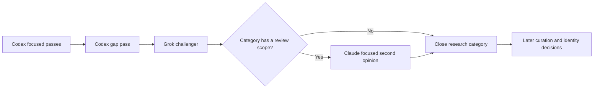

# Bounded challenger routing

Scout can add one scoped Claude second opinion after the ordinary Codex-primary,
Grok-challenger sequence for selected categories. This is an explicit category
policy, not a learned model ranking or automatic recursive partitioner. The
six-category architecture review determines whether and where to use it.



The additional assignment is created only after Grok completes. Its sealed
exclusion list includes both Codex and Grok candidates. It asks for at most eight
well-supported additions in the specified pathways; zero additions is a valid
outcome. It uses the existing durable assignment/result machinery. Returning a
lead does not accept it or authorize publication.

A routing file contains a version, concrete scopes, and reviewable reasons:

```json
{
  "schemaVersion": 1,
  "version": "example-bounded-review-v1",
  "categories": {
    "financial-assistance": {
      "scope": "Check missing public-benefit application and appeal pathways.",
      "reason": "Example only; choose the actual policy after the architecture review."
    }
  }
}
```

Pass it with `--profile codex-grok --routing-policy PATH`. Categories without a
rule retain the ordinary pair. The selected providers, scope, predecessor and
reason become part of the category's stored plan and hash. A changed policy is
refused when it conflicts with an existing plan. Resuming uses the stored
assignments; it cannot silently replace a challenger or rerun a finished category.
Telemetry labels routed runs separately from the original fixed-pair experiment.

The browser shows the second-opinion scope and predecessor. A finished primary
now remains marked complete while its challengers work.

## Failure and measurement policy

One local runner holds an exclusive lock for the canonical database path. A dead
process releases the operating-system lock; the remaining lock file is not proof
that a worker is alive. Inspect actual processes before resuming a legacy runner
that predates this mechanism.

Authentication failure, explicit timeout, and Claude's terminal turn-limit error
stop the run without unchanged retries. There is no automatic partitioning or
silent provider fallback. Diagnose the cause before changing credentials, worker
budget, task scope, or provider. Other existing retry behavior is retained.

Use `--codex-reasoning-effort high` to set production Codex workers explicitly.
The conversation's effort selection is separate from these CLI processes.
The [Codex configuration reference](https://learn.chatgpt.com/docs/config-file/config-reference)
documents `model_reasoning_effort`; the installed CLI accepts it through `--config`.
Claude's built-in tools are restricted to WebSearch and WebFetch, using the
[documented `--tools` flag](https://code.claude.com/docs/en/cli-reference).

Missing usage counters are unknown, not zero. Provider turn counts are reported
in their native units. Summaries distinguish successful and failed worker elapsed
time; neither measures pure active inference. Raw-candidate rates are not accepted
resource rates. Legacy zero counters remain ambiguous.

## Preparing a separate production copy

`python3 -m resource_research_agent.production_prep` requires all three selected
six-category conditions to be complete and a written review artifact. It refuses
an existing destination. It never starts a worker.

The preparation process:

1. Opens the three source databases read-only and checks their shared baseline.
2. Copies Codex+Grok to a new database and preserves its six completed jobs and
   sealed assignments unchanged.
3. Replaces only untouched future placeholders in that new copy with the reviewed
   plan. Any assigned pass, contribution, external assignment or telemetry blocks
   placeholder replacement. The original databases retain their full history.
4. Creates separate finished manual runs containing the completed responses from
   all three conditions, with source condition, role, assignment hash and original
   contribution ID recorded. These runs preserve the union for later curation;
   they do not create accepted-resource judgments.
5. Checks source hashes again and writes a preparation manifest. The existing
   curation selector chooses these richer union runs for the reused categories.

Run the prepared copy with `--reuse-completed`, the same routing file and
`--max-categories 21`. The cap means 21 total completed categories, including the
six already completed, so only 15 new categories need research. Do not pass the
production command an experiment database path.

Preparation preserves uncertainty and unresolved identity decisions. Curation
must still resolve aliases, ordinary access locations, obsolete programs, direct
service fit, eligibility and current access. The experiment cannot establish
accepted-identity yield until those decisions are recorded with provenance.
