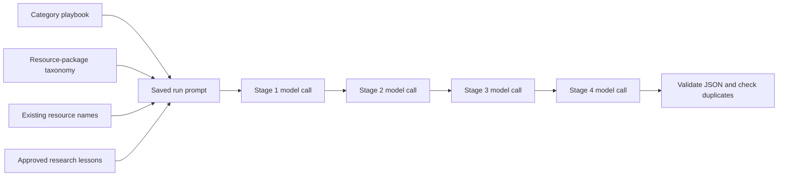

# How Resource Research Agent Prompts Work

The model receives much more than the assignment visible in the text box. That sentence is the headline; the application builds a structured research brief around it.



## 1. The underlying model persona

DeepSeek Harness receives this short system-level persona from `dsh-research.patch.yml`:

> You are a careful social-service resource researcher. Research the public web, preserve source URLs, distinguish official facts from attributed lived experience, and return exactly the structured result the assignment asks for.

The Harness is also restricted:

- Web search is enabled.
- Each search can return up to eight results.
- Full web-page fetching is currently disabled.
- Shell, filesystem, editing, workflows, skills, and subagents are disabled.
- It runs in an empty temporary workspace.

So DeepSeek can search, reason over search results, and return findings, but it cannot touch the resource package or application files.

The lack of full-page fetching is an important limitation: verification may depend heavily on search-result content. That is one reason human review remains essential.

## 2. The category playbook

Selecting Clothing/Household loads `resource_research_agent/playbook_library/clothing-household.json`. It contributes:

- The default assignment
- What belongs in the category
- What must be excluded
- Questions that should be verified
- Four different research stages

For example, it explicitly says to exclude:

- Ordinary clothing, thrift, furniture, appliance, and department stores
- Donation sites that do not distribute goods
- Undependable online giveaways

This guidance is separate from—and stronger than—the visible assignment.

## 3. Information added from the resource package

The application then adds current package information:

- Category ID and label
- Existing Type labels for that category
- Package-wide For groups
- Geographic focus
- Names and IDs of resources already assigned to the category
- Package identity and version context

For the current Clothing/Household category, the generated prompt contains four known resources. DeepSeek sees their names so it should not return them as discoveries. During broad research, it does not receive every complete imported record—only names and IDs.

## 4. Approved research lessons

Any active lessons for that category are inserted as `activeLessons`.

This is how the application “teaches” the model. It is not modifying DeepSeek’s neural network or permanently training the model. Instead, the lesson is repeated in future prompts.

For example:

```json
{
  "scope": "category",
  "text": "Do not treat ordinary thrift stores as clothing assistance unless a voucher or free distribution program is verified."
}
```

Agent-proposed lessons require approval before becoming active. Feedback downloaded from the portable review app is not yet consumed automatically.

## 5. The assembled prompt

A Clothing/Household stage currently produces a prompt of roughly 7,700 characters. Abbreviated, it looks like this:

```json
{
  "role": "Clothing/Household resource discovery researcher for a human-reviewed social-service directory",
  "assignment": "Discover realistic clothing and household-goods resources...",
  "researchContext": {
    "mode": "package",
    "sourcePackage": {
      "name": "provo-resource-package.zip",
      "category": {
        "id": "clothing-household",
        "label": "Clothing/Household"
      }
    }
  },
  "categoryBrief": {
    "playbookVersion": "1.2.0",
    "playbookSource": "clothing-household.json",
    "availableTypes": [],
    "availableForGroups": ["Families with children", "Seniors", "Veterans"],
    "geographicFocus": "Utah County first...",
    "scope": ["..."],
    "exclude": ["..."],
    "verificationQuestions": ["..."],
    "evidenceRules": ["..."]
  },
  "knownResources": [
    {"id": "...", "name": "Food and Care Coalition"}
  ],
  "activeLessons": [],
  "rules": [
    "Research the public web only.",
    "Do not edit the imported package.",
    "Known resources must not be presented as new discoveries.",
    "Return only one valid JSON object.",
    "Prefer a few well-investigated candidates over shallow directory entries."
  ],
  "researchStage": {
    "position": 1,
    "total": 4,
    "title": "Clothing and footwear access",
    "instruction": "Investigate free clothing closets, vouchers, shoes, coats..."
  },
  "completedStageFindings": []
}
```

It also includes a detailed output template for every candidate: name, organization, website, service area, eligibility, barriers, availability, evidence, unknowns, classifications, and follow-up branches.

## 6. Four separate model calls

A normal category run is divided into four independent calls. For Clothing/Household:

1. Clothing and footwear access
2. Furniture and household essentials
3. Emergency and specialized replacement
4. Inventory and access gap review

Each call receives the complete base brief plus its own stage instruction.

Later stages also receive:

- Summaries from completed stages
- Names of candidates already found
- A rule not to repeat those candidates

The application does not depend on the model remembering a continuous conversation. It explicitly carries forward the relevant results.

## 7. What happens to the answer

DeepSeek must return JSON shaped roughly like:

```json
{
  "summary": "What was researched and found",
  "candidates": [
    {
      "name": "Example Clothing Closet",
      "website": "https://...",
      "geography": "Utah County",
      "eligibility": ["..."],
      "barriers": ["..."],
      "availability": {
        "status": "available",
        "asOf": "2026-08-18",
        "evidence": "..."
      },
      "evidence": [
        {
          "url": "https://...",
          "sourceType": "official",
          "finding": "..."
        }
      ],
      "unknowns": ["..."]
    }
  ],
  "lessons": []
}
```

The application then:

- Confirms that it received a JSON object.
- Confirms that `candidates` and `lessons` are arrays.
- Removes malformed entries.
- Suppresses candidates already returned by name during that run.
- Compares candidates with the imported package’s full duplicate index.
- Saves the candidate and possible match separately for human review.

One current weakness is that validation is not yet strict for every candidate field. It strongly requests the full structure, but a candidate missing some secondary fields can still be retained for Curator review.

## 8. How human sharpening works

The reusable category instructions live in `resource_research_agent/playbook_library/`. Editing a playbook changes future runs.

Each run saves its assembled prompt and stage instructions in the research database. Therefore:

- Improving a playbook does not rewrite old research history.
- Old runs retain exactly what they were told.
- New runs receive the improved version.
- Category lessons provide an additional, faster feedback layer.

So the architecture is less “ask DeepSeek to research Clothing” and more “construct a small, category-specific research contract, execute it in four controlled passes, and preserve everything for Curator and human judgment.”
