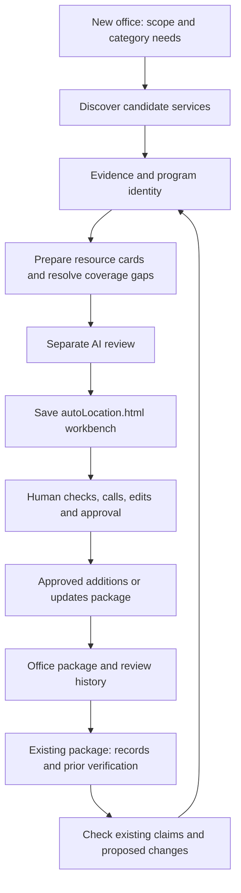

# A proposal for Resource Scout: discovery and maintenance

Prepared for Michael at Extra High, September 19, 2026 Mountain time
(September 20 UTC). **Proposal for discussion, not a change to the running
St. George workflow or authorization for new worker calls.**

## Recommendation

Build Scout around two jobs with one shared evidence and review process:

1. **Build a new office's resource collection.** Find useful services, establish
   who can actually use them, prepare clear resource cards, and create
   `auto[Location].html` for human vetting.
2. **Check an existing collection.** Revisit its resources, identify material
   changes or unresolved concerns, and put proposed changes into the same kind
   of workbench without overwriting the trusted package.

The unit of success is a **useful, correctly described service that a person can
actually access**, eventually accepted by a human. It is not a research pass, a
model response, a row, or a majority vote among AIs.

Use distinct assignments for discovery, coverage review, evidence verification,
and preparation of the resource card. One capable AI can perform those roles in
separate contexts. A second provider is an optional source of different search
behavior and judgment, not a dependency that defines the product. The experiments
support testing that design; they do not establish that one provider can replace
every contribution of another.

Keep the existing HTML workbench and resource-package system. Replace the idea
of collecting more lists until research feels complete with a documented account
of **coverage, evidence, unresolved questions, and human decisions**.

## What the two workflows should feel like

For a new TSO, Michael selects **Build resources for a new office**, supplies the
office identity, service area and category template, reviews the work/usage plan,
and starts. Scout researches and prepares proposals within that plan. It reports
what it is doing and handles routine recovery. At completion it presents the
review handoff. Under our current agreement, Michael starts an Astra/Codex session
for the final AI review, then saves `auto[Location].html`. Stephanie and other
vetters use that file to check, call, edit and approve resources. Only their
approved selections become a mergeable office resource package.

For maintenance, Michael selects **Check an existing resource package**, supplies
the current package, and chooses all resources or a targeted review. Scout
compares present evidence with the saved records. The workbench emphasizes
**what changed, why Scout thinks it changed, and what still needs confirmation**.
The vetter accepts, edits or declines proposals; approved updates return to the
office through the normal package workflow with the original resource identities.

The final AI review means ready for **human vetting**, not that the resources have
already been human-vetted. Important unresolved questions can travel to the
workbench, clearly marked. A questionable claim must not appear there as settled
fact merely to make the run look complete.

## Stephanie's resource card is the output contract

Each card starts with the program name, a short description of the service,
website, phone and location/service area. Its practical information follows her
four headings, consistently:

| Heading | What the person needs to know |
|---|---|
| **Eligibility requirements** | Who qualifies: geography, age, household/income rules, referral requirements, required documents and meaningful exclusions. |
| **How to best connect** | The best first action: call a particular intake number, use an application, attend a meeting or obtain a referral. Include preparation that improves the chance of getting help. |
| **Access (hours, etc.)** | Intake hours versus office hours, appointments/walk-ins, location or remote access, language/accessibility information, and waiting-list or capacity limits when known. |
| **Important information to know** | Fees and funding, time limits, practical conditions, service limitations, and cautions that affect a referral. |

Write for the resource specialist and the person seeking help. Be concise and
specific. Do not include a research essay, repeat marketing claims, or fill a
missing field with plausible guesses. Keep the supporting sources and audit
detail accessible in the workbench, apart from the concise card.

Missing facts become focused vetting questions: **“Confirm whether new clients
can walk in; the website only lists office hours.”** A legitimate service with
unpublished intake hours can still be worth vetting. A wrong-state service cannot
be rescued by attaching a local phone number.

Maintain one underlying fact for information repeated in a standard field and
the four headings; a later change to hours must not leave contradictory prose.
Render these sections into the current TSO field format first. A separate local
model or structured-text-extraction project is not needed for this proposal.

## Discovery: start with coverage, then allocate research

### Establish the actual geography

Office identity and service area are different. “Welfare Square” is an office
name, not a sufficient geographic instruction. The run needs explicit cities,
counties/state, whether nearby services are usable, and how to handle statewide,
remote and cross-border services. Preserve the agreed scope with every assignment.

Check **eligibility for a resident of the target area**, not just whether a
provider has a nearby address. A distant office can administer a valid statewide
benefit; a similarly named county elsewhere can be entirely irrelevant. Do not
invent a universal mileage limit. Agree any practical travel boundary at setup.

### Use a category coverage checklist, not a target number of passes

Retain the useful subject knowledge in the playbooks, but make their purpose
explicit: define the important ways people obtain help in that category. For
Employment, these include immediate work, training, supported employment, public
workforce services and populations facing barriers. These are research questions;
they are not necessarily eight mandatory paid calls.

Start each category with a bounded primary assignment or a few genuinely
different assignments when its breadth warrants them. Research can use familiar
providers, public systems, community/faith organizations, specialized populations
and remote access. Preserve previous credible discoveries as leads to recheck so
a fresh model execution does not erase yesterday's useful knowledge. Preserve
prior rejection reasons too; do not repeatedly resurrect the same unsuitable lead.

Maintain a small coverage record for each important pathway: evidenced options,
searched but unresolved, not applicable with a reason, or a remaining gap. Mark
critical pathways explicitly. A populated category is not automatically covered;
twenty similar commercial listings may still omit its accessible public route.
The checklist is a starting hypothesis, not a closed inventory: the complementary
assignment must also look for important needs or access routes the checklist missed.

### Ask for a complementary search, with no novelty quota

Use a fresh context to inspect the coverage record and pursue missing pathways
through different vocabulary or source channels. Provide the existing identities
to avoid unnecessary duplication, but allow four kinds of useful result:

- an additional service/program/access pathway;
- a correction to an existing candidate;
- evidence that changes an eligibility, access or identity judgment;
- an unresolved gap that needs another kind of check.

This changes the present challenger's strict “new identities only” brief. A
worker that finds a geographic mistake in a known resource should report it,
not discard it because that resource is on the exclusion list. Report discovery
yield and corrections separately so neither inflates the other.

An empty additions list is an acceptable outcome. New rows are not a quota.
Repeat a search only for an explicit unresolved question within the agreed
budget. If the budget ends with a consequential gap, show the gap; do not call it
resolved and do not spend indefinitely trying to make the list look exhaustive.

### Verify the evidence before polishing the card

For each retained proposal, keep a compact evidence record linking its important
claims to a source page/document, relevant passage or location, retrieval date,
and any source publication/effective date. Opening a page today does not make an
old eligibility rule current. A search snippet or an AI summary alone is not
sufficient support for a consequential eligibility, geography or intake claim.

Require explicit page/document inspection for those claims. Use official provider
and administering-agency evidence where available. When official sources
conflict, preserve the conflict and investigate which applies to this program
and date. A phone-vetted fact in the package should not be silently replaced by
an older webpage. Several agreeing model answers are not independent evidence
if they all came from the same stale listing.

Discovery should capture this evidence as it works. Verification can reuse saved
pages and claim records, with fresh retrieval for gaps, conflicts or stale sources.
It should not routinely repeat the entire research assignment. Give every retained
card a claim-support check, and allocate deeper independent investigation according
to the consequences and uncertainty of its claims.

Code checks missing citations, malformed data, inconsistent links and obvious
scope conflicts. AI interprets whether the cited source really supports the
claim. Neither check alone proves truth. Human contact resolves information that
public sources cannot reliably establish. An unopenable source is a retrieval
problem, not proof that the service closed.

## Identity and curation: one program can belong in several categories

Maintain a shared program registry across the office. Distinguish the organization,
its actual programs, and material access locations. A new program at a known
organization can be genuinely new; an alias or second description of the same
program is not. A directory is a research/navigation source unless it provides a
useful service itself; it does not make every unmentioned member “already found.”

Use stable resource IDs independent of names and URLs. Keep separate programs when
their service, eligibility or intake differs meaningfully. Apply multiple
categories to the same program when it directly supplies those services. Preserve
its general title when adding a population-specific category; do not rename a
general outpatient program as exclusively for pregnant women.

Curation combines identity resolution, evidence-backed selection and card
preparation. It accounts for every candidate and every promised merge. If a
worker says financial-assistance instructions were incorporated into a clinical
resource, validate that the actual application/contact detail survived, not just
that the candidate ID is linked.

Bound work by evidence size and related program groups. Reuse the current
checkpointing; do not restore giant category contexts. Build cards from the
shared records, then perform a final cross-category audit. Uncertain identity
merges remain proposals rather than destroying the original records.

## Maintenance: a proposed change, never a silent replacement

Start from an immutable snapshot of the actual current package, including stable
IDs and available human verification history. This is a different assignment
from discovery: **“Check this known program and its claims,”** not “find more.”

For each resource, record an overall finding and field-level evidence:

| Finding | Workbench treatment |
|---|---|
| Appears current | Show what was actually checked and when; do not imply unexamined fields were verified. |
| Material change supported | Show old value, proposed value, source, relevant date and the reason the change matters. |
| Sources conflict / cannot verify | Preserve the old package value and show the conflict or focused question; do not advance its verification date. |
| Possibly moved, renamed or closed | Present evidence and alternatives for human confirmation; a broken link alone cannot retire a resource. |
| Identity problem | Propose a merge/split or program correction with effects on IDs, categories and prior notes visible. |
| Related new program found | Put it in a separate additions queue; do not let maintenance expand into an unbounded discovery run. |

An update might say: **“Package: walk-ins accepted. Current intake page:
appointments required. Proposed change: call intake first. Confirm whether this
applies to new clients only.”** Formatting-only differences should not be mixed
with material changes that could send someone to the wrong place or prevent
them from qualifying.

Prioritize never-reviewed and older records, previously unresolved conflicts,
important/volatile access facts, and explicit change signals. A stable website
does not guarantee stable services; a changed page does not necessarily mean its
service facts changed. Begin with configurable review priorities, not a claim
that we have already learned the right intervals. Perform an initial whole-package
audit, then support periodic targeted checks and a periodic full sweep.

Keep separate dates for **source checked**, **AI reviewed**, and **human verified**,
with the scope/method of verification. The current `verifiedOn` field alone is
too ambiguous for this purpose: the running curation prompt uses it for current
web-source checking, not phone verification. Do not reinterpret old dates as
human verification when migrating data.

### Applying an approved update safely

Accept changes individually or as a clearly reviewed group. Keep the original
resource ID for an update; a new program receives a new ID. Retirement is an
explicit human decision using normal package deletion/history rules. Deleting an
unaccepted proposal from the workbench must not delete an existing office record.

Bind each proposed patch to its baseline record/version and preserve the before
and after values. Before merge, compare with the newest office package. If the
same field was edited since the audit, show a conflict rather than letting a
newer timestamp overwrite it. Preserve unrelated intervening edits. This merge
check must be implemented and tested before maintenance updates are offered as
safe routine exports; the current additions-only workbench is not sufficient.

## The workbench should minimize human reconstruction

Preserve the normal TSO reading, search, printing and Admin editing experience.
Add only what helps a vetter decide: the proposed card; relevant sources and
dates; unresolved questions; and, for maintenance, an old/new comparison.

Keep human approval explicit and separate from AI review. In discovery the
existing Curated/selection control can continue to mean the vetter is ready to
package the entry. In maintenance, make acceptance of changes explicit. Allow
work to be parked for a phone call or declined with a short optional reason;
record that outcome without requiring vetters to score AI performance.

Keep existing category and For-group definitions. Assign them only when supported;
do not create new groups as a side effect of research. Group uncertain taxonomy
questions for an administrator instead of multiplying labels across cards.

Two different saves need clear names: **save/resume my workbench** and **export
approved resource changes**. Browser-local state alone should not be the only
copy of hours of vetting. Provide a tested, portable checkpoint containing edits,
pending decisions and provenance. Only hide exported items after a successful
save; cancellation leaves them intact. Reopening a checkpoint must restore the
same work and prevent accidental duplicate exports.

Independent HTML copies do not synchronize. For the initial workflow, allocate
different categories/resources to vetters and use merge conflict checks. Do not
pretend a server-backed collaborative editor is already available or make it a
prerequisite for delivering the two requested jobs.

Preserve discovery → proposal → human decision → final package identity links
in a durable review ledger. Keep the standard package compatible; if it cannot
carry all audit metadata, retain a linked checkpoint/ledger and test that the
association survives export and merge. Missing from a later package does not by
itself mean “rejected.”

## AI roles, provider choices and effort

| Responsibility | Proposed allocation |
|---|---|
| Scheduling, snapshots, identity links, formatting and validation | Scout code; no AI needed for routine bookkeeping. |
| Discover and interpret service pathways | Capable worker at High with bounded assignments and live sources. |
| Complementary coverage search | Fresh-context worker with a genuinely different brief; same model is allowed, another provider optional. |
| Verify claims and prepare concise cards / maintenance changes | High worker with source evidence and specific questions. Separate tasks/contexts where needed, not necessarily one paid call for every row. |
| Difficult conflicts, consequential omissions and final cross-category review | Astra/Codex at Extra High under the present human-started handoff. Use bounded evidence, not the entire accumulated research history. |
| Actual acceptance, phone vetting and retirement decisions | Human vetters. |

For today's Mac, retain the authorized Codex/Grok configuration while we validate
the replacement design separately. For church deployment, design the roles so
they can all be fulfilled by approved Claude workers in fresh contexts. That is
a deployment option to test, not a demonstrated performance claim. Authentication,
automation permissions, billing identity and church-account spending must be
verified on that infrastructure before any paid run. Nothing here enables Claude
on Michael's Mac. Extra High for this proposal does not alter current worker
settings. No additional local AI is required.

Start with explicit routing rules: unfilled critical coverage, contradictory
sources, ambiguous identity or unestablished local access. Do not route based on
the mere presence of an uncertainty sentence or raw row count. Log the reason and
budget for every extra task. Learn routing thresholds only after we have enough
traceable human outcomes; current experiments do not supply that ground truth.

## Reliability belongs in Scout

Every job has an explicit state, bounded assignment, immutable inputs, saved
result, validation outcome and restart history. A live supervisor tracks actual
worker progress and failures. A heartbeat proves liveness, not productive work.

Resume completed work without another model call. Recover bounded structural and
transient failures where tested; retain original attempts. Diagnose authentication,
quota, context, transport and content problems separately. Do not split an
authentication failure into smaller research assignments. Do not let a worker
“repair” a schema problem by changing service facts or discarding difficult rows.

Use a configured provider allowlist, per-task/run usage limits and bounded
recovery. If actual dollar cost is unavailable, report the available counters and
their limits instead of asserting a dollar cap. Surface **waiting for login**,
**usage limit**, **needs review**, and **complete** as different visible states.
Test notification delivery; a successful notification command alone does not
prove the operator saw it.

The monitor should distinguish source submissions, consolidated candidates,
AI-prepared proposals and human-approved resources. Its headline shows the phase,
current category, last real activity, progress and any required action. At research
completion, the next phase must be unmistakable. Once Michael and Astra agree
unattended operation is ready, Scout can automatically proceed to curation with
the preselected effort/budget. Until then, preserve the agreed transition gate.
The final requested AI review remains a separate handoff unless Michael changes
that agreement.

## Why this differs from what we have tried

| Observation | Consequence for the design |
|---|---|
| Five workers produced useful unique finds, but the smaller arrangement was operationally faster; fresh primaries also varied substantially. | Preserve discoveries and test task design. Do not infer a fixed model winner from list length or unmatched runs. |
| The two-category same-model follow-up produced 23 screened additions versus 27 for saved Grok, with only six shared identities. | Assignment diversity is useful. Same-model follow-up remains a candidate architecture, not established equivalence. |
| The pilot joined Utah contacts to Virginia/Maryland library evidence and used legacy BYU-Pathway eligibility. | Require explicit geography and current-rule evidence. Novelty search is not factual verification. |
| Both High and Extra High curation left consequential issues; the comparison used different categories and workloads. | Keep High as the practical worker baseline and spend Extra High on difficult review. Do not claim a measured causal effort advantage. |
| Employment had eight passes but 52 candidates; early categories pooled several historical conditions. | Pass counts and curation batch counts measure different things. Do not use pooled early-category totals as normal production cost/yield benchmarks. |
| A placeholder row stopped curation for hours; whole-category context failed elsewhere. | Use durable bounded tasks, tested semantic limits on repair, explicit stops and meaningful alerts. |
| Geographic errors and lost merged details survived fluent output. | Validate claim support and actual retained content, not only JSON shape and candidate accounting. |

## What to reuse, what to build

Reuse the category knowledge, versioned assignments, SQLite checkpoints, original
response/provenance retention, provider execution boundaries, bounded curation,
structural validators, supervisor, review fingerprint, HTML template and normal
resource-package format. Preserve all completed research. A clean design does
not require replacing the database or discarding working components.

Build the missing contracts: explicit office/service-area scope; claim-level
evidence and verification dates; a shared program identity record; coverage
decisions; structured corrections alongside new discoveries; maintenance
before/after proposals; safe update merging; and portable human-review outcomes.

Some older product/enrichment documents still describe the five-provider roster
and a separate three-heading enrichment pass. Those are historical mechanisms,
not the recommended new design. The current curation prompt already asks for
Stephanie's four headings. Consolidate the documentation and flow around the
chosen design when it is approved, rather than requiring users to understand
several generations of Scout.

## A staged implementation and test plan

1. **Close the current St. George cycle.** Finish the authorized curation, perform
   the separately requested final review, deliver the workbench, and collect real
   vetting outcomes. Do not rewrite an active experiment to test this proposal.
2. **Make the resource/evidence/review contract solid.** Add the four-section card
   checks, explicit verification scope, stable identity links, human-review
   checkpoint and merge safeguards. Use saved evidence and fixture packages first;
   no rediscovery is needed to test a failed save or lost update.
3. **Ship a bounded maintenance pilot.** Choose a small, explicit sample from a
   real existing package: stable records, changed contacts/eligibility, conflicting
   sources, unavailable pages, ambiguous identities and remote services. Produce
   reviewable proposals only, then have ordinary vetters accept/edit/reject them.
   Test a concurrent package edit before exporting/applying approved updates.
4. **Compare discovery architectures on held-out work.** Freeze the coverage
   brief, provider settings, budgets and scoring policy before running. Compare
   the current Codex/Grok approach with the proposed same-model roles on the same
   starting evidence. Separate prompt effects from provider effects where feasible,
   repeat enough cases to observe variability, and include a new locale. Use the
   same downstream verification/curation in both arms so one does not win by
   being given an extra reviewer. Keep errors already exposed here as regression
   cases, not as unseen evaluation evidence.
5. **Approve unattended operation and deployment.** Test process interruption,
   authentication/quota stops, exhausted recovery, malformed output, save
   cancellation, resumption and notification delivery. Then enable the agreed
   research-to-curation transition. Test the Claude-only option separately on
   church hardware/account if that deployment is selected.

The order deliberately gets human outcome evidence before trying to learn which
model, effort or pass pattern to prefer. Automatic lesson distillation and broad
adaptive routing remain deferred. Normal vetting supplies feedback; Stephanie
should not acquire a second job rating AI answers.

### How to judge whether it works

For discovery, measure consequential coverage gaps, material factual errors,
human-accepted distinct services, marginal accepted contributions, duplicate/noise
burden, and correction/phone work per accepted resource. For maintenance, measure
confirmed material changes, false change/closure alarms, missed known changes,
preservation of trusted fields and IDs, and human time per approved update.

For both, record successful and failed worker time, wall-clock delays, available
tool/token/cost counters and restarts. Use accepted identities per active research
minute and marginal accepted identities per extra research minute only once human
outcomes exist; keep human review effort alongside those efficiency measures.
Record incomplete/missing measurement rather than substituting raw submissions.

Release tests should account for every input, preserve every approved update and
unrelated intervening edit, reject known dangerous geographic/eligibility errors,
and prevent repeat paid calls after completed checkpoints. Human acceptance and
phone verification must never be inferred from AI completion. Passing a finite
test set is evidence of readiness, not a guarantee of exhaustive discovery or
future factual perfection.

## Decisions this proposal recommends

Adopt two modes over one evidence and human-review process. Keep the HTML
workbench. Make complementary discovery and verification separate responsibilities.
Allow a same-model deployment with optional provider diversity. Keep High workers
and selective Extra High review. Build safe maintenance changes and portable
review history before adding more model orchestration. Preserve the current
St. George workflow while these changes are designed and tested.

## Evidence behind the proposal

- [Six-category architecture review](six-category-architecture-review-20260918.md)
- [Five-model versus Codex–Grok comparison](five-worker-versus-codex-grok-20260918.md)
- [Same-model complementary-assignment pilot](codex-followup-pilot-20260920.md)
- [Curation effort comparison and limitations](curation-effort-review-20260919.md)
- [Current orchestration and human review agreement](scout-orchestration.md)
- Current implementation inspected: `scout_curation.py`,
  `scout_curation_runner.py`, `scout_review_handoff.py`, `scout_review.py`,
  `resource_package.py`, and `playbook_library/README.md`.

Prior project notes on maintenance and learning informed preservation and human
feedback requirements. Their old model choices and implementation timetable are
not adopted here. The implementation sequence, revised challenger contract,
evidence model and release criteria above are recommendations, not claims that
those capabilities are already complete.
