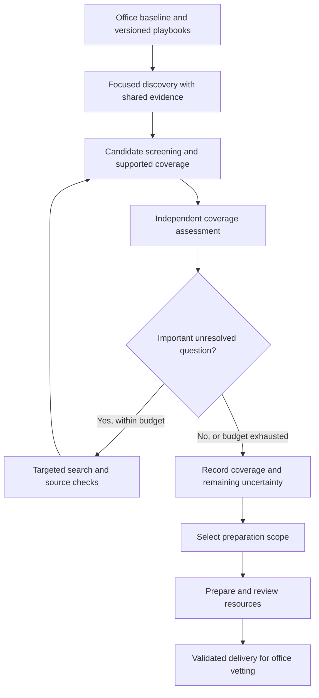

# Scout: DeepSeek evaluation and discovery design

Version 1 · September 27, 2026 · Design for review

## Purpose and recommendation

Build a controlled, affordable evaluation of DeepSeek, then use its results to improve Scout's discovery workflow. Preserve the playbooks, provenance, resumability, and delivery contracts that already provide value.

The primary objective is shorter reliable turnaround to a useful resource collection at the required quality. Michael's Codex usage allowance is a real operating constraint. Secondary objectives are lower AI cost and usage, less correction and missionary review work, and manageable ongoing maintenance.

Treat these as separate questions:

1. Can DeepSeek independently execute Scout's primary research playbooks?
2. Can it prepare resources and perform useful review with acceptable correction work?
3. Does a coverage-driven workflow improve the result or reduce the work?
4. What would a complete office run cost, and how much Codex work would remain?

Start with Mesa Housing, extend to Food and Disability if promising, and use saved Codex research as a historical comparison. Evaluate model substitution before changing the discovery policy. Keep the initial implementation small and isolated from current office runs.

This document records the direction agreed in this conversation. Numerical limits and unresolved delivery choices below are recommendations, not measured results or new spending authorization. Creating the design does not start workers or alter Mesa's ongoing review.

## Agreed direction and boundaries

| Item | Design basis |
| --- | --- |
| Quality | Preserve essential service coverage, factual support, practical access, program identity, and visible uncertainty. |
| Core collection | Approximately 150–200 good distinct resources is a planning target. It is not a quota, proof of completeness, or an automatic deletion threshold. |
| Research method | Retain versioned playbooks with service pathways, alternative vocabulary, source channels, and exclusions. |
| Challenger | Evaluate coverage and assumptions, conduct bounded follow-up, and retain some independently chosen exploration. |
| Candidate handling | Screen early; preserve evidence and distinct programs; invest detailed preparation where it adds value. |
| Evaluation | Separate model effects from workflow effects. Preserve original outputs, errors, and outcome attribution. |
| Cost estimate | Include complete-workflow projections for DeepSeek throughout and DeepSeek with Codex final review. |
| Reuse | Share supported evidence across categories and offices while checking local eligibility, access, and freshness. |
| Later operation | Support maintenance and gap research after an office has a strong collection. |
| Learning | Propose playbook changes from supported outcomes; keep activation explicit and versioned. |

An AI-prepared resource is not office approval. Research dates are not telephone-verification dates. Human edits, hidden choices, stable IDs, and unresolved conflicts retain their existing meaning.

## Current baseline and why it matters

The September 27 Mesa checkpoint records 1,885 resource identities assembled from overlapping research and preparation evidence. These are working review identities, not a completed importable collection or human-approved resources. The full preparation job includes 3,920 overlapping candidate records from several earlier research rounds. This is broader than a fresh single-policy discovery run.

The roughly 50-hour figure discussed with Michael is an estimated cumulative workload covering original research, challengers, current re-curation, and current review, excluding the original curation. It is not a measured 50-hour calendar turnaround. Research assignment intervals, worker time, tool latency, waiting, and concurrent activity must remain distinguishable.

The current gap-pass implementation uses zero- and one-candidate branches as follow-up signals. The challenger receives discovered identities and searches for additional direct-service candidates. These mechanisms help find omissions, but do not by themselves establish adequate coverage or validate the original facts.

The earlier Welfare Square challenger comparison retained 77 DeepSeek proposals after curation. Its three DeepSeek research runs cost an estimated $0.2575 in model charges, excluding Codex search relay, supervision, and evaluation. DeepSeek saw the existing primary findings. That result supports testing independent research; it does not establish primary-research equivalence, complete-run cost, or office approval.

The current DeepSeek adapter supports native search and direct public-page fetching, but is wired to challenger packets. A primary-research evaluation needs a separate adapter path that preserves primary pass semantics and does not import trial results into production.

## Evaluation design

### Freeze the experiment before generating answers

Create an isolated evaluation directory with a manifest containing:

- Exact starting office package, geography, category IDs, selected research version, and input hashes.
- Playbook, assignment, tool, normalization, and preparation-policy versions.
- Exact requested model and reasoning settings, returned model metadata where available, research dates, and pricing reference.
- Budgets, stop conditions, sample-selection rules, essential coverage criteria, and evaluator instructions.
- Saved Codex baseline provenance, including its actual model/settings when recorded and explicit unknowns when absent.

Select one coherent saved Codex primary run per comparison. Do not combine the strongest findings from multiple Codex runs, challengers, and final review into a supposedly equivalent primary baseline. Historical union evidence can inform evaluation after DeepSeek's outputs are frozen.

DeepSeek receives the original office baseline and applicable playbook, not the later Codex answers. Subsequent focus and gap passes receive only its own accumulated discoveries plus the original known-resource baseline. Reconstruct dynamic assignments accordingly; copying a later Codex assignment could leak its discoveries through the exclusion list.

Use DeepSeek-native search and direct fetching so routine research does not consume Codex search-relay work. Record that this is a comparison of complete research setups, not an isolated test of model weights.

### Stage A: independent research

1. Run Mesa Housing using the existing focused-pass and gap-pass policy, without another challenger. Compare primary research with primary research.
2. Check completeness, sources, errors, useful coverage, cost, and correction work. Diagnose serious problems before expanding.
3. If promising, run Food and Disability under the same experimental rules.

Housing tests identity and access complexity; Food tests common local and public-benefit pathways; Disability tests specialized eligibility and less obvious service mechanisms. These are deliberately selected screening categories, not a representative statistical sample of every office need.

Historical web changes must be distinguished from model mistakes. If an important difference could be explained by source date, search tooling, or ordinary variability, investigate that specific case. Commission a narrowly bounded fresh Codex control only when it could change the decision. One old result is not an estimate of the latest Codex model's average performance.

### Stage B: preparation and final-review samples

Prepare 20 original candidate packets: 12 selected reproducibly across the three categories, and eight deliberately selected difficult cases. Keep the two groups separate in the report. Include program-versus-organization boundaries, geographic scope, conflicting eligibility, changed intake, uncertain operation, and an apparently straightforward record with a consequential detail.

Use original research packets and sources, not polished Codex answers. Apply the current five-section preparation requirements, source rules, identity constraints, and uncertainty states. Compare with compatible saved preparation where available. Label incompatible historical policies; do not silently treat their differences as model effects.

The sample must include a compact collection, not only independent records: overlapping organizations, cross-category membership, starter selection, and non-starter consideration reasons. Otherwise it will not exercise the collection-level work that contributes heavily to final review.

Give a fresh DeepSeek review context the frozen candidate and draft evidence, with the existing review requirements. Preserve its findings and revisions separately. Audit the final outputs against sources using bounded Codex review and human input where necessary. A fresh context supplies separation of drafting and review, but does not establish independence of the underlying model's errors.

Use historical difficult cases to test error detection. Preserve the original facts and label those cases as diagnostic fixtures. If controlled errors are introduced, place them only in explicit evaluation copies; they are not evidence about natural error frequency.

### Stage C: revised discovery policy

After Stage A is frozen, test the proposed coverage-driven workflow with the same DeepSeek configuration and starting package. Keep the old and new conditions separate. Use Housing first; expand only if the result warrants the expense.

Compare coverage, consequential errors, total preparation workload, elapsed time, spending, and Codex correction demand. Include audit effort and any saved effort from omitted low-value preparation. A shorter candidate list alone is not success.

Do not require a full four-way model-by-workflow matrix initially. If a borderline outcome could reflect ordinary run variation or an interaction between model and policy, repeat the smallest informative condition before making a production decision.

### Evaluation and advancement

Freeze essential client-need pathways before viewing DeepSeek's output. Preserve the hidden resource reference separately. Permit genuinely equivalent alternatives; recovering the same name is not required. After reveal, verify useful discoveries from either side and expand the evidence union without retroactively changing the original score definition.

Evaluate service coverage and correctness separately. Distinguish a new organization, a distinct program, an improved access route, an ordinary duplicate, and a correction. Credit each outcome once at the appropriate level.

| Check | Advancement rule |
| --- | --- |
| Essential coverage | Each predeclared essential need has a supported route or an evidence-backed limitation. A known useful route that was missed remains an omission; vague “unavailable” wording cannot satisfy the check. |
| Consequential errors | Wrong identity, geography, eligibility, operation, or intake triggers diagnosis. Repeated instances of the same consequential failure require a targeted retest before expansion. |
| Final sampled output | Every discovered consequential error is corrected or held visibly before the sample is called ready. A clean small sample is not a guarantee of zero errors elsewhere. |
| Preservation | No lost source records, unauthorized human-state changes, unsafe identity merges, or fabricated verification dates. |
| Operational usefulness | Record whether reduced Codex research is offset by added correction, review, or supervision. |
| Efficiency | Show comparable time and usage with the quality checks intact; include failures and recovery. |
| Generalization | A three-category Mesa success permits a bounded trial in another office; it does not prove general replacement. |

Label evaluator outputs anonymously where practical and freeze judgments before revealing provider attribution. The supervising reviewer may still recognize styles or earlier examples; do not call this independent double-blind evaluation. Save supporting source evidence and disposition reasons so judgments can be reviewed.

Office-vetted outcomes remain the strongest operational feedback when available. In their absence, label results as source-audited research/preparation proposals rather than human acceptance.

### Proposed experiment limits

Recommended initial envelope: **$20 in total new DeepSeek and associated paid-tool charges** across the staged pilot. Proposed reservations are $3 for initial Housing research, $6 for Food and Disability, $4 for preparation/review samples, $6 for revised-policy comparisons, and $1 contingency. These are ceilings, not expected prices. Reallocation must be recorded within the total ceiling.

Recommended additional limits: 60 minutes of worker elapsed time and 60 paid model calls per research category; no more than two targeted recovery attempts for a diagnosed transport problem. Never repeat a failed paid request unchanged without diagnosing it. A capped or incomplete run is reported as such, not silently extended or scored as a finished answer.

Before dispatch, reserve enough budget for the maximum next request, including billed reasoning and tool charges. Reconcile provider usage with charges or balance changes where available; concurrent account activity and delayed billing make balance changes imperfect attribution. If a tool's maximum charge cannot be bounded, resolve its pricing before using it under the cap. No automatic credit purchase or provider fallback.

Codex evaluation gets one focused comparison packet per stage, with escalation only for consequential unresolved findings. Record its usage separately. Do not impose an arbitrary hard stop that would label a partially checked result as approved.

## Proposed discovery workflow

### Playbooks and coverage

Keep stable focus keys, source channels, vocabulary, and exclusions. Add a manageable list of important service/access pathways with priority and evidence requirements. Avoid a combinatorial checklist of every population by every service.

Coverage records cite candidate IDs, source evidence, practical access, known limits, and the reasoning behind their status. Suggested statuses are supported, weak, unresolved, and investigated-without-a-supported-route. Record investigation date and scope. These are research assessments, not claims that capacity is currently available or a service cannot exist.

A completed focus pass does not automatically mean adequate coverage. One program may satisfy several needs; many listings may describe one access route. Preserve materially distinct programs even when they share a name, organization, address, or website.

### Challenger responsibility and stopping

Provide the challenger with a compact coverage account and access to the supporting evidence. Ask it to challenge essential gaps, source quality, program boundaries, access assumptions, and the playbook's omissions. Require each proposed follow-up to identify the need, evidence weakness, likely benefit, and a bounded search assignment.

Retain one small independently chosen exploration allowance per category, including apparently well-covered categories. This protects against inheriting the primary's blind spots. Its findings are subject to the same evidence and marginal-value checks.

The challenger can return useful additions, corrections, unresolved concerns, or a supported recommendation to stop. Finding zero worthwhile additions is valid. A different model offers another perspective but does not independently verify facts simply by agreeing.

Proposed initial policy: at most two targeted follow-up rounds per category, within the category budget. Stop when essential coverage has been assessed and remaining searches have no supported prospect of materially improving the collection, or when the budget is reached. Record which condition ended the work. An unresolved essential gap produces a visibly incomplete coverage assessment, not a false completion claim or an unlimited search loop.

### Screening and preparation scope

Before extensive drafting, establish credible identity, direct service relevance, geography, practical contact/intake, and potential contribution. Inconclusive leads receive an explicit investigation state with evidence; they do not disappear.

Maintain separate concepts:

- **Core preparation candidates:** strong, complementary choices toward the office's roughly 150–200-resource target.
- **Prepared reserve:** useful alternatives and specialized pathways that meet the agreed preparation and review contract.
- **Research archive:** retained discoveries and evidence that have not earned or completed preparation. These are not exposed as usable referral-ready records.

Starter membership and human Curated status remain separate. Seven to ten starters per category means category placements, not necessarily that many distinct resources. Selection should protect rare consequential pathways and useful independent alternatives; it should not simply rank by popularity or raw model confidence.

The current contract requires every usable reserve record to survive independently of starter selection. Initial model evaluation preserves that scope. The narrower preparation policy is an experimental scenario until the intended reserve service level is decided. Existing prepared records are not demoted or removed merely to meet the target.

## Complete-run cost and time estimates

### Required outputs

The evaluation must deliver a cost workbook or equivalent machine-readable table, a readable report, and an assumptions ledger. Report actual pilot spending before projections. Produce low, expected, and high scenarios for:

| Model arrangement | Existing complete-delivery scope | Proposed core plus selected prepared reserve |
| --- | --- | --- |
| DeepSeek research, preparation, and review | Required estimate | Required scenario, conditional on reserve size |
| DeepSeek research/preparation with Codex final review | Required estimate plus remaining Codex demand | Required scenario plus remaining Codex demand |

Each includes focused research, coverage assessment/challenger work where applicable, targeted follow-up, preparation, identity/taxonomy reconciliation, final review, corrections, validation, and recovery. Deterministic work may have no model fee but still takes elapsed time. Office phone vetting and maintenance are reported separately from the initial AI workflow.

DeepSeek-throughout describes the projected operating arrangement. It does not remove the independent audit needed to evaluate the pilot. Show one-time implementation and evaluation costs separately from recurring per-office operating cost.

### Measurements

For each request/stage, preserve model/settings, start/end times, call outcome, native usage, applicable rates, searches/fetches, retries, and output size. Separate uncached input, cached input/cache creation where applicable, output, and reasoning according to the provider's billing definitions. Do not count reasoning twice when it is already included in output.

Record proposed and retained program identities, source occurrences, category memberships, prepared records, consequential errors, corrections, and reviewer effort. Record three clocks: calendar turnaround, summed worker elapsed time, and reviewer/human effort. Worker elapsed time includes tool/provider waiting and is not pure inference.

Track Codex token/call usage when available. Missing counters remain unknown. Subscription allowance percentages cannot be inferred from worker hours or converted to cash using API prices. Account-wide before/after allowance readings are only supplementary observations when concurrent work and resets can be accounted for.

### Estimation method

1. Calculate measured model and tool charges from the actual pricing schedule at execution. Retain the dated source. Compare ledger totals with available billing evidence.
2. Classify the office's research categories by observed workload, such as straightforward local services, broad multi-program systems, and specialized eligibility/access. Map all categories explicitly; use the actual office catalog and assess Miscellaneous separately.
3. Estimate research from pass mix, call usage, source work, and category complexity. Three categories give scenario anchors, not a statistically representative mean.
4. Estimate preparation by the number of records receiving full preparation and the observed easy/difficult mix. Add distinct costs for cross-category reconciliation and category-membership explanations.
5. Estimate review from ordinary checks, difficult cases, corrections, and collection-level decisions. Do not assume global identity reconciliation scales linearly with resource count; use measured overlap rates and a stated sensitivity range.
6. Include retries and recovery in the expected/high cases. For low/expected/high scenarios, vary candidate and reserve volume, complexity, cache behavior, applicable rates, and correction burden. Report these as sensitivity scenarios, not confidence intervals.
7. Estimate calendar turnaround from the planned dependency graph and explicit concurrency limits. Summed worker times are not calendar times; shared provider limits and Codex quota interruptions can dominate the schedule.

Illustrative structure, with measured coefficients supplied by the test:

`Full-office cost = research + coverage/follow-up + preparation + collection reconciliation + final review/corrections + recovery + paid tools`

For the hybrid arrangement, show DeepSeek dollars and residual Codex usage side by side. Do not assign a fictitious marginal dollar cost to subscription-covered Codex work. If a cash-priced alternative is modeled, label it as a separate pricing scenario.

Also show incremental cost and time per additional 100 prepared reserve resources, with the stated complexity assumptions. If a stage lacks enough evidence, expose its estimated contribution and uncertainty rather than presenting a fully measured total. A cheap projection remains conditional on acceptable quality.

## Evidence reuse, maintenance, and learning

Store source evidence once with URL, retrieval time, content hash, geographic scope, and supported claims. Reuse it across categories and suitable offices. Review program identity before sharing facts; an organization's broad services do not automatically apply to every named program. Avoid public claims based on a funding award or planning document without evidence of operation and intake.

Recheck volatile facts such as availability and application windows. Stable national-program evidence may be reusable longer, but local delivery, eligibility, contacts, and access still need assessment. Record refresh policy by fact type rather than a single universal expiry.

Maintenance compares the existing office collection with current evidence and reports appears-current, changed, possibly closed/moved, cannot-verify, identity/scope conflict, or new related program. Show old/new facts and evidence for review. A broken webpage alone is not closure; Scout never silently overwrites trusted human data.

Recurring verified omissions can produce proposed playbook amendments. Keep evidence, examples, version changes, and explicit activation. Do not turn model self-assessment or absence from a package into truth. Automatic learning remains deferred until sufficient attributable normal vetting outcomes support a readiness review.

## Implementation increments and verification

| Increment | Deliverable and exit condition |
| --- | --- |
| 1. Evaluation foundation | Isolated manifests, baseline exports, primary DeepSeek adapter, budget checks, usage ledger, and resumable artifacts. Validate no writes/imports to production. |
| 2. Research pilot | Housing result and source audit; then Food/Disability if warranted. Preserve all raw answers and capped/failed outcomes. |
| 3. Preparation/review pilot | Twenty original packets, a collection-level fixture, saved draft/review versions, audited findings, and workload measurements. |
| 4. Cost report | Complete-run scenarios with measured/inferred labels, scope assumptions, Codex demand, and time estimates. |
| 5. Coverage experiment | Versioned coverage records, bounded challenger/follow-up, explicit stop reasons, and comparison against the same-model baseline. |
| 6. Future-office trial | Run the selected design in a bounded different office before changing the production default. |
| 7. Incremental operations | Shared evidence refresh and maintenance mode, followed later by reviewed playbook improvement. |

Reuse the existing playbook/assignment builders, provider transport, checkpoints, source storage, and output validators where their contracts fit. Keep model selection separate from research policy. Add explicit experiment identifiers instead of changing the meaning of existing sealed jobs.

Required implementation checks cover input leakage, budget reservations, native usage accounting, retries and resume, provenance links, distinct-program preservation, missing counters, unresolved coverage, zero-addition challenger results, production isolation, human-state preservation, and existing export compatibility. Test substantive behavior and failure recovery; passing structural checks is not a semantic quality verdict.

Bound concurrency to independent work after runtime measurement. A category's later passes depend on its earlier findings; final collection reconciliation depends on the prepared inputs. Workers should checkpoint and supervisors should recover routine failures without requiring Michael to babysit runs.

## Decisions remaining before launch or adoption

No additional input is required to complete this design. The following are visible recommendations to settle at the relevant stage:

| Decision | Recommended starting point | Needed when |
| --- | --- | --- |
| Evaluation spending envelope | $20 total new provider/tool spend, staged as above; no automatic increases | Before paid evaluation launches |
| Initial DeepSeek configuration | Existing `deepseek-flash` configuration with max thinking, with resolved model and rates verified at launch | Before manifest is sealed |
| Core and reserve service level | Preserve current scope for model comparison; evaluate a separate core plus selected prepared reserve scenario | Before narrower scope becomes a real delivery policy |
| Reserve size in projections | Show a range until the coverage study supports a size; do not invent a fixed optimal count | During cost report |
| Production model roles | Decide from stage-specific quality, time, and residual Codex demand | After evaluation |
| Success beyond Mesa | One bounded different-office trial, with the same quality requirements | Before general rollout |

The immediate next deliverable is the isolated evaluation foundation and its frozen protocol. Current Mesa review, existing registry records, prior deliveries, and active office runs remain outside this experiment's mutation scope.

## References inspected for this design

Links below point to versioned repository copies. The later September 27 working review checkpoint and runtime timing evidence were inspected locally and are not included in this documentation commit.

- [Current Scout status](../SCOUT_STATUS.md) — operational snapshot; may advance after this document's date.
- [Mesa full preparation run](mesa-full-prepared-run-20260926.md) — scope and preserved inputs.
- Mesa original research timing (local runtime evidence: `data/mesa-prepared-full-20260926-source-checks/review/mesa-original-research-timing-20260927.json`) — measured intervals and the qualified cumulative estimate.
- [Prepared-resource contract](scout-prepared-resources-contract.md) — five sections, reserve, starters, considerations, identity, and human-state boundaries.
- [Focused research implementation](../resource_research_agent/focused_research.py) and [challenger assignments](../resource_research_agent/codex_first_research.py) — present discovery behavior.
- [DeepSeek runner](../resource_research_agent/deepseek_challenger_runner.py) — current transport, search, budgeting, and challenger-specific integration.
- [DeepSeek challenger evaluation](deepseek-challenger-comparison-20260921.md) and [curation follow-up](challenger-curation-comparison-20260921.md) — historical findings and limitations.
- [Six-category architecture review](six-category-architecture-review-20260918.md) — research/setup confounders and outcome-measure limits; provider-selection decisions are historical.
- [Research learning design](codex-research-learning-design.md) — provenance and reviewed learning principles; older workflow details are not current policy.
- [DeepSeek model pricing](https://api-docs.deepseek.com/quick_start/pricing/) — verify and save the applicable schedule when the evaluation starts.

This is a versioned Markdown design document. It does not replace a synced ChatGPT project reference, change the operational handoff, or claim that the proposed workflow is implemented.
